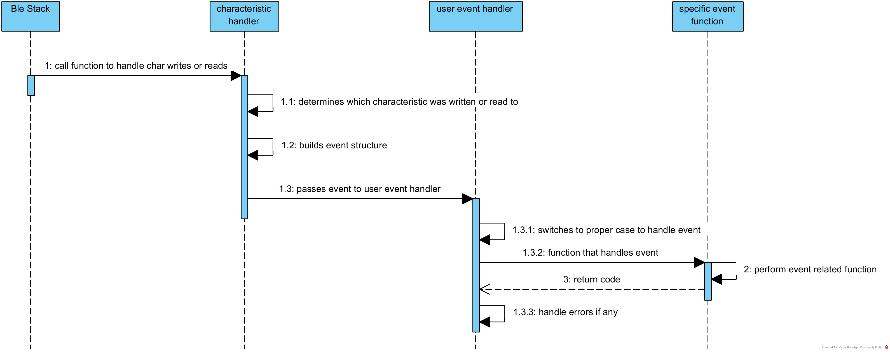

# BLE Vehicle Firmware

## Project Description

This project was for developing the firmware side of a Bluetooth Low Energy RC vehicle. The reason the BLE stack was used is to have a protocol that is implemented on most devices (phones, tablets, and laptops) that can be used as the controller. The stack is also used for its power efficient design since communication does not require a large bandwidth.

----

## Building

Because this code relies on the ESP-IDF that has it own compiler for building projects, The user should make a copy of the __gatt_server__ example located in the __Espressif\frameworks\esp-idf-v5.0\examples\bluetooth\bluedroid\ble__ directory. Once the copy has been made the user should then copy the code from this repository into __gatt_server__(copy)__\main__. Start the __ESP-IDF 5.0__ app and change the directory to your copy directory. you will need to make some changes to the sdkconfig before you build the program.      
     
begin with 
> idf.py menuconfig

once you the IDF configuration editor you should do this

> Component --> FreeRTOS --> configENABLE_BACKWARD_COMPATIBILITY   

Once you have this set up you save the changes by pressing __SHIFT-Q__ and accepting the changes.

once everything is done build the program or flash it to an ESP32.     
>idf.py build

or     

> idf.py -p (name of COM port) flash monitor

----

## Hardware Information

The device this code is to compile for is the ESP32 SoC development kit, which in my case was the ESP-WROOM-32D. 

### Pins used

the list of all the pins used to connect to the various parts of the RC vehicle.

* Hotor PWM Pins
    1. Right Motor Pin - 17
        1. Right Motor Direction Pin 1 -  19
        2. Right Motor Direction pin 2 - 18
    2. Left Motor Pin - 5
        1. Left Motor Direction Pin 1 - 15
        2. Left Motor Direction Pin 2 - 4
* Horn pin - 2
* RGB PWM Pins
    1. Red Pin - 22
    2. Green Pin - 32
    3. Blue Pin - 23

### Motor Controller pins
The project expects the use of some kind of H-bridge circuit to control the two seperate motors. The two Direction pins are used to control the orientation that the motor spins. The pins are controlled based on the value sent to the Motor Control Characteristic. The signedness of the value sent controls the pins.

#### Positive Value

| Pin 1 | Pin 2 | 
|-------|-------|
| 1     | 0     | 

#### Negative Value

| Pin 1 | Pin 2 | 
|-------|-------|
| 0     | 1     |

### Other Pin Information

Since the ESP32 can only provide so much current on its GPIO pins all the pins for the horn and RGB light are expected to function as on/off signals for somthing else to drive those devices.

----
## BLE Information

At the momement the device keeps advertising until a central device connects to it. When the connected device disconnects the sensor begins to advertise again.

----
### Sevices and Characteristics

The devices has three services, however, only one is implemented and that is the __motor Control Service__ (for main vehicle control).

* motor Control Service :UUID - 0xfb349b5f8000008000100000FF000000 | UUID for motor Control Service 
    1. Motor Control Characteristic :UUID - 0xfb349b5f8000008000100000FF010000 | Is an eight byte value where each four byte value is used to control the PWM signal for a motor contoller (there are two motors to control)
    2. Horn Control Characteristic :UUID - 0xfb349b5f8000008000100000FF020000 | Is a single byte true or false value used to turn the horn on or off (in the case of our build it was a simple buzzer). Where any value other than zero equal true.     
    3. RGB Control Characteristic :UUID - 0xfb349b5f8000008000100000FF030000 | is used to control the RGB headlight (single in our case). this is a four byte value where the most significant byte is red, green, blue, and then alpha (which only lowers the brightness on all of them).

----

## Event and Service Design

### Sevices and Characteristics Design

----

### BLE Event Handling

